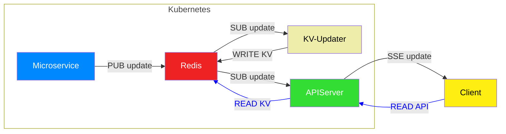

# 🖥️ webdisplay
Webdisplay is a lightweight, read-only React interface designed to complement . Built for clarity and modularity, it provides a dashboard-style view into your environment and system events—plus minimal control hooks.

## 🔗 Overview
- Interfaces with a local apiserver via:
- GET /api/key/* — retrieves startup state
- SSE /api/events — subscribes to live updates
- Designed as a passive view layer with optional control buttons
- Ideal for kiosk-style display, self-hosted dashboards, or utility monitoring

## 🧩 Structure
```
src/
├── components/        # Modular UI blocks (Enviro, Sports, Controls)
│   └── Environment/   # Current conditions, forecast, moon phase, etc
│   └── MLB/, NFL/     # Game status modules
│   └── WebControlButtons.js  # Triggers for matrixclient actions
├── pages/             # Route-level containers
├── services/          # API layer and data handling
├── utils/             # Sorting and utility methods
└── index.js           # Entrypoint
```

## ⚙️ Setup

for local testing:
```bash
npm install
npm start
```

Environment config (via .env.local or similar for testing):
```bash
export REACT_APP_API_BASE=http://localhost:3000/api
```

🐳 Deployment
Webdisplay ships with all the essentials for clean Kubernetes deployment:
🔧 Provided Assets
| File | Purpose | 
|---|---|
| Dockerfile | Builds the Node.js/React frontend container | 
| build.sh | Script builds and pushs image to your container registry | 
| webdisplay-deployment.yaml | Declares the webdisplay Pod spec and labels | 
| webdisplay-service.yaml | Exposes the Pod via ClusterIP | 
| webdisplay-ingress.yaml | Routes external traffic to the service via Ingress | 


📦 Build & Push
```bash
./build.sh
```

🚀 Deploy
```bash
kubectl apply -f webdisplay-deployment.yaml
kubectl apply -f webdisplay-service.yaml
kubectl apply -f webdisplay-ingress.yaml
```

You’ll be up and running inside your cluster in minutes—no manual fiddling required

*Note:* Requires a running [APIServer](https://github.com/dekeyrej/apiserver) with SSE enabled.

## 🧪 Features
- 🌤️ Environmental dashboard (Weather, Air Quality, Lunar/Solar events)
- ⚾️ MLB and 🏈 NFL game status modules
- 🧮 Clean component breakdown
- 🕹️ Minimal control buttons for matrixclient interop

### 🌤️ Environment Page (Default View)
The default landing page offers a rich, modular snapshot of current environmental conditions—ideal for kiosk-style setups or passive monitoring.
Sections
- Current Conditions:
Displays temperature, humidity, wind direction/speed, AQI rating and numerical score. Updated regularly via GET /api/key/*.
- Astronomics:
Includes moon phase visuals, sunset and moonset times, plus lunar illumination. Cleanly separated for night-oriented automation logic.
- Hourly Forecast:
Shows temperature and “feels like” conditions on an hourly scale, giving a clear outlook across the day.
- Multi-day Forecast:
Extended view with daily high/low temperatures and weather summaries. Useful for broader environmental trend watching.
UX Notes
- Layout stays intentionally minimalist and styling-agnostic to preserve downstream adaptability.
- Refresh timestamps provide helpful hints about data currency.
- Sections mirror the internal component breakdown in src/components/Environment/ for easy developer mapping.

### 🏈 NFL Page
Even during the offseason, webdisplay’s NFL module offers a clean, organized preview of upcoming action. It's designed to anticipate the regular season kickoff, providing a full snapshot of Week 1 matchups.
Features
- Structured Schedule View:
- Games grouped by time slot (Thu–Mon) with clear separation
- Team records defaulted to 0-0, denoting pre-season state
- Logos enhance quick visual scanning for fans or casual viewers
- Minimal Interaction Layer:
- Read-only format for offseason monitoring
- No live data bindings until season start—keeps resource usage light
- Component Mapping:
- Driven by modules in src/components/NFL/:
- NFLPre.js handles pre-season views
- Other components (NFLInProgress.js, NFLPost.js) activate in-season
Dev Notes
This page doubles as a “quiet state” handler—demonstrating how the project remains fully operational even when data sources are dormant. 

### ⚾ MLB Page (the _real_ reason I started this whole project)
The MLB page offers dynamic game summaries using real-time data when the season's active—and remains cleanly informative with archival or post-game stats.
Features
- Per-Game Breakdown:
    - Each matchup shows final scores, logos, records, and team stats
    - Columns for Runs (R), Hits (H), and Errors (E) deliver baseball-standard clarity
    - Games are presented in a scrollable, responsive format ideal for kiosks or dashboards
- Current Season Awareness:
    - Handles daily game lists with timestamped results
    - SSE-updates drive up-to-date status for each of the days' games as they move from Scheduled -> In Progress -> Final via MLBInProgress.js, MLBPost.js, MLBPre.js
- Visual Hierarchy:
    - Logos and score columns pop for quick visual parsing
    - Clean grid-based layout maximizes readability without distracting fluff

Dev Notes
- Stats are sourced from GET /api/key/mlb and auto-updated with SSE /api/events
- Designed to remain functional whether data is active, static, or unavailable


## 🧠 System Architecture
Webdisplay is part of a fully modular dashboard ecosystem powered by Kubernetes-deployed microservices, real-time eventing, and dual frontend clients.
🧬 Microservices
A fleet of Python containers fetch and publish data streams including:
- 🌫️ Air Quality Index (AQI)
- ☀️ Weather & Moon Phase
- 🧭 Family Events & Google Calendar
- 🔗 GitHub metadata
- ⚾ MLB & 🏈 NFL stats

### 🔄 Flow Summary

Data updates traverse the Redis pub/sub system in real-time:



Blue links represent one-time fetches at startup.

### 🧱 Core Components
| Component | Role | 
| Microservices | Ingest live data and publish to Redis | 
| KV-Updater | Maintains latest feed states in Redis KV | 
| APIServer | Central API hub + Redis event listener | 
| MatrixClient | Raspberry Pi-hosted LED interface, SSE-enabled | 
| nodewebdisplay | Browser-based dashboard, SSE-enabled | 


### ⚾ MLB Polling Strategy
⏱ At 11:30 AM EDT, the MLB service:
- Checks daily game schedule
- Sleeps until first pitch
- Polls every 30 seconds during active games
- Sleeps after final game concludes

This keeps network and CPU use efficient while maintaining responsive UI updates for users.


## 💬 Philosophy
Built to be low-friction, style-agnostic, and easy to remix. Just enough surface area to visualize what matters—and tinker when needed.
